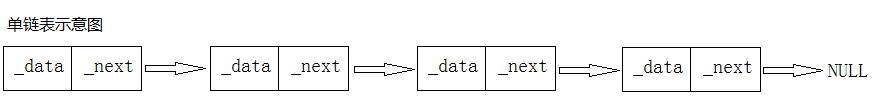

# 链表、数组

### 定义
>链表是一种物理存储单元上非连续、非顺序的存储结构，数据元素的逻辑顺序是通过链表中的指针链接次序实现的。

### 图例（单链表）


### 结构
1. 存储数据的域
2. 指向下个结点的指针

### 单链表

```java
public class MyLinkList<T> implements Iterable<T>{
    //node内部类
    private  class Node{
        T t;
        Node next;
        Node(T t,Node next){
            this.t=t;
            this.next=next;
        }
    }
    //大小
    private int size = 0;
    //头结点
    private Node head;
    public void add(T t){
        Node node=new Node(t,null);
        if(size==0){
            head=node;
            size++;
        }else{           
            node.next=head;
            head=node;
            size++;
        }
    }
    public T remove(){
        if(size==0){
            return null;
        }
        Node node = head;
        head=head.next;
        T t=node.t;
        node=null;
        size--;
        return t;
    }
    public int size(){
        return size;
    }
    @Override
    public Iterator iterator(){
        return new LinkIterator();
    }
    private class LinkIterator implements Iterator<T>{
        Node nextNode=head;
        @Override
        public boolean hasNext(){
            return nextNode!=null;
        }
        @Override
        public T next(){
            if(nextNode!=null){
                T value=nextNode.t;
                nextNode=nextNode.next;
                return value;
            }
            return null;
           
        }
    } 
    public static void main(String[] args){
            MyLinkList<String> list = new MyLinkList<>();
            list.add("aa");
            list.add("bb");
            list.add("cc");
            for(String value : list){
                System.out.println(value);
            }
            System.out.println("===========remove");
            list.remove();
            for(String value : list){
                System.out.println(value);
            }
    }
```
运行：
```bash
> Task :run
cc
bb
aa
===========remove
bb
aa
```

### 反转单链表
``` java
 private Node reverse(Node node){
        Node nextNode=node;
        Node headNode=null;
        while(nextNode!=null){
            Node foo=nextNode.next;
            nextNode.next=headNode;
            headNode=nextNode;
            nextNode=foo;
        }
        return headNode;
    }
```
参数为传入的头结点，nextNode表示要进行反转的结点，headNode表示已经反转的头结点

运行
```bash
dd
cc
cc
bb
aa
===========reverse
aa
bb
cc
cc
dd
```

### 双向链表
```java
private  class Node{
        T t;
        Node pre
        Node next;
        Node(T t,Node pre,Node next){
            this.t=t;
            this.pre=pre;
            this.next=next;
        }
    }
 ```
