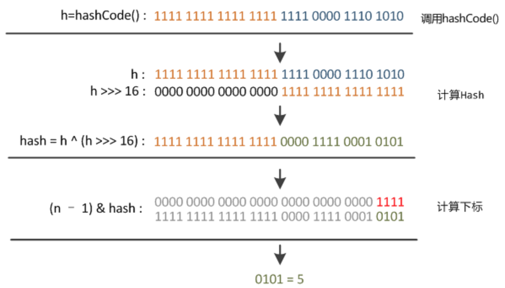

# 字典、关联数组
## 定义
>将一个键值与值关联起来，又叫做符号表，索引。
## 三种经典实现
1. 哈希表
2. 二叉查找树
3. 红黑树

_本节主要指哈希表_

## 哈希函数
1. 除法散列法

h(k)=k mode m(m取质数最好)

2. 乘法散列法

h(k)=m(kA mod 1)向下取整，m可选为2^p  限制A为形如s/2^w的分数，s取自0<s<2^w的整数。约为（根号5-1）/2

3. 全域散列法(数论)
    * 选择足够大的素数p ,Zp={0,1,...,p-1},Zp*={1,2,...,p-1};
    * a属于Zp*,b属于Zp
    * Hab(k)=((ak+b)mod p)mod m

## 拉链法散列表图例

## 实现
1. 数据采用双向链表
```java
private class Node<K,V>{
        K key;
        V value;
        Node next;
        Node pre;
        Node (){
            
        }
        Node (K key,V value,Node pre,Node next){
            this.key=key;
            this.value=value;
            this.pre=pre;
            this.next=next;
        }
    }
```
2. 数组简单固定
```java
private Node[] tables;
....
MyHashMap(){
        tables=(Node<K,V>[])new Node[10];
    }
```
3. 哈希算法
```java
private int hash(int key){
        int hashNumber=key%9;
        return hashNumber;
    }
```
4. 插入
根据hash算法获取index,如果数组中存在值，则插入到链表
5. 查找
根据hash算法获取index,并遍历相应数组位置的链表

## java8中的hashmap
1. 链表大于8的时候采用红黑树
2. 哈希算法
```java
static final int hash(Object key) {   //jdk1.8 & jdk1.7
     int h;
     // h = key.hashCode() 为第一步 取hashCode值
     // h ^ (h >>> 16)  为第二步 高位参与运算
     return (key == null) ? 0 : (h = key.hashCode()) ^ (h >>> 16);
}
```


