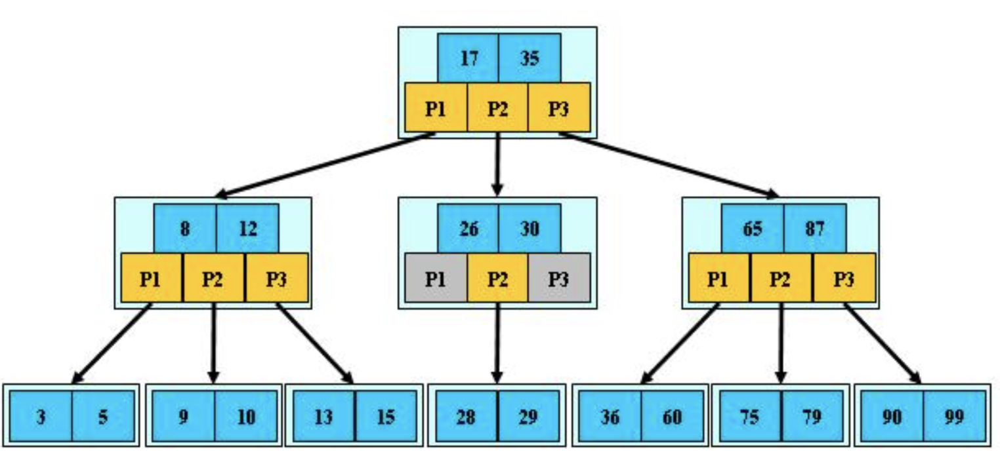
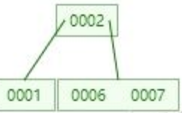
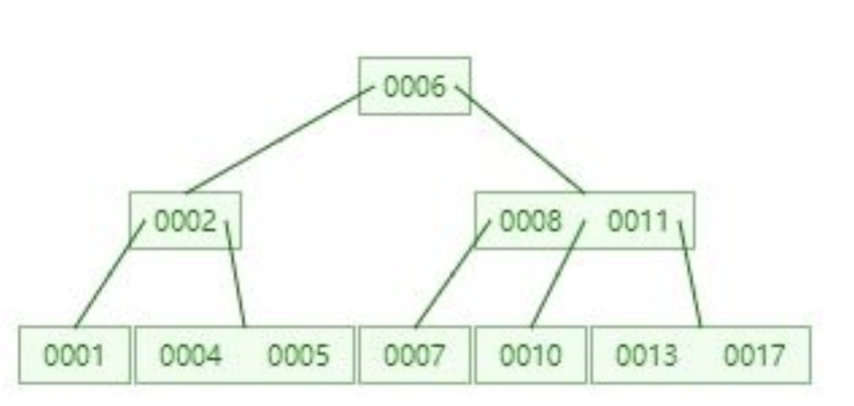
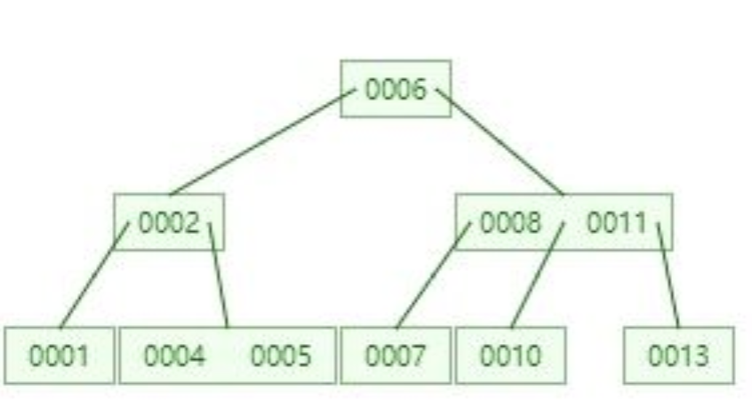
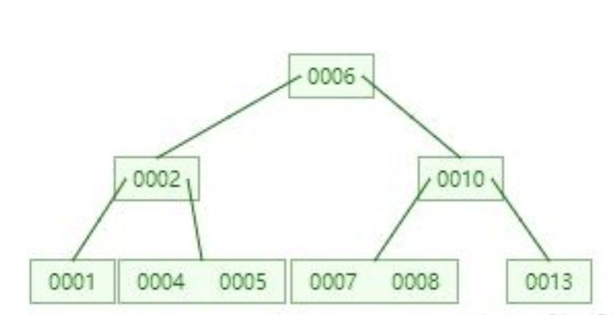
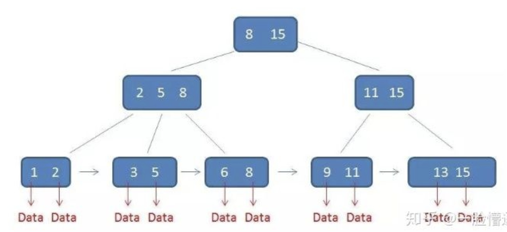
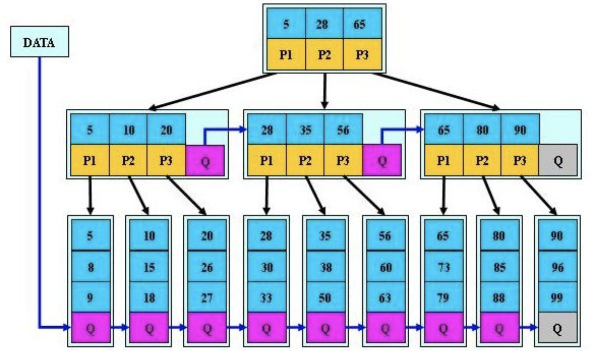

# B-，B+，B*树
##  B-定义
> 一颗m阶b树是一颗平衡的m路搜索树。它或者是空树，或者满足下列性质：
>1. 根结点至少有两个子女
>2. 每个非根结点所包含的关键字个数j满足m/2-1<=j<=m-1
>3. 除根结点外的所有结点（不包含叶子结点）的度数正好是关键字总数加1，内部子树个数k满足：m/2<=k<=m;
>4. 所有叶子结点都位于同一层
### 图例

### 查找
b-树是二叉排序树的扩展，二叉排序树是二分查找，b-树是多路查找，因为b树结点内的关键字是有序的，可以用二分法查找
### 插入
在插入的过程中可能会破坏b树的特征，如是结点中关键字的个数超过m-1.此时需要进行结点的拆分。例如，建立4阶b树，关键字个数在1-3。开始插入三个数
  
当插入下个结点的时候，关键字个数变为4，需要拆分，将中间的位置作为新的根结点，左右关键字分别作为连个子结点
  
以此类推，每次插入如果关键字个数大于规定，则进行拆分，树的高度便因此增长
### 删除
对于删除，当删除掉需要删除的关键字后，也可能会破坏b树特性，如关键字个数少于规定个数。可以向兄弟结点借关键字或者孩子结点进行关键字的交换，也可能进行结点的合并。
  
当删除17后
  
删除11结点后，进行了子结点的交换，8和10的交换

## B+树
### 特点
1. 有k个子树的中间结点包含有k个元素（b树中是k-1），每个元素不保存数据，只用来索引，所有数据都保存在叶子结点中
2. 所有叶子结点包含了全部的元素信息，以及指向含这些元素记录的指针，且叶子结点本身依关键字的大小自小而大顺序链接
3. 所有的中间结点元素同时存在于子结点，在子结点元素中是最大或最小元素
### 图例

### 查询
b+树的查询要到叶子结点
##  B*树
### 定义
>b*树是b+树的变体，在b+树的非根和非叶子结点在增加指向兄弟的指针。  

>b*树定义了非叶子结点关键字个数至少为(2/3)*m
### 图例

