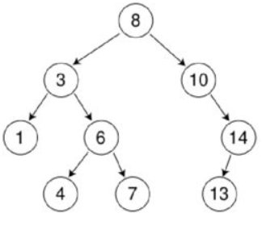
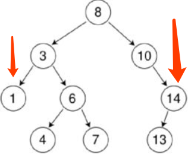

# 二叉树查找树
## 定义
>二叉查找树，又称二叉排序树（binary sort tree）或二叉搜索树，性质如下：    
> 1. 若左子树不空，则左子树上所有结点的值均小于它的根结点的值；
> 2. 若右子树不空，则右子树上所有结点的值均大于它的根结点；
> 3. 左右子树也分别为二叉查找树
> 4. 没有健值相等的结点
## 图例

## 构建
```java
public class BST<Key extends Comparable<Key>,Value>{
    private Node root;
    private class Node{
        private Key key;//键
        private Value value;//值
        private Node left;//左子树
        private Node right;//右子树
        private int N;//该结点子树中结点个数，包括该结点
        public Node(Key key,Value value,int N){
            this.key=key;
            this.value=value;
            this.N=N;
        }
    }
}
```
## 查找
根据定义左子树的值都小于它的根结点，右子树的值都大于它的根结点，当查询一个值时，从根结点开始：  
1. 如果根结点的值等于查询的值，则返回根结点；
2. 如果查询的值小于根结点的值，则递归查询左子树
3. 如果查询的值大于根结点的值，则递归查询右子树
4. 递归查询后树中没有查询的值，返回null
### 示例
1. 成功查找示例：查询值为4，先从根结点开始，根结点的值为8，大于4；则查询左子树，左子树根结点值为3，小于4；查询右子树，右子树根结点值为6，大于4；查询左子树，根结点值为4，等于查询的值，返回该结点。
2. 失败查找示例：查询值为15，先从根结点开始，根结点值为8，小于15；则查询右子树，右子树根结点值为10，小于15；则查询右子树，根结点值为14，小于15；继续查询右子树，右子树为null，没有查到，返回null
### 代码
```java
public Value get(Key key){
    return get(root,key)
}
private Value get(Node x,Key key){
    if(x==null){
        return null;
    }
    int cmp = key.compareTo(x.key);
    if(cmp>0){
        return get(x.right,key);
    }else if(cmp<0){
        return get(x.left,key);
    }else{
        return x.value;
    }

}
```
## 插入
与查找类似，先进行查找，找到该值，则替换；没有该值，则在最后返回null处插入该值形成的结点
```java
public void put(Key key,Value value){
    root = put(root,key,value);
}
private Node put(Node x,Key key,Value value){
    if(x==null){
        return new Node(key,value,1);
    }
    int cmp = key.compareTo(x.key);
    if(cmp>0){
        x.right = put(x.right,key,value);
    }else if(cmp<0){
        x.left = put(x.left,key,value);
    }else{
        x.value=value;
    }
    x.N=(x.left==null?0:x.left.N)+(x.right==null?0:x.right.N)+1;
    return x
}
```
## 最大最小值
  
通过上图可以看出，最小值为该bst递归左子树获取的最左结点；最大值为该bst递归右子树获取的最右结点。
```java
public Value min(){
    return min(root).value;
}
private Node min(Node x){
    if(x.left==null){
        return x;
    }
    return min(x.left);
}
public Value max(){
    return max(root).value;
}
private Node max(Node x){
    if(x.right==null){
        return x;
    }
    return max(x.right);
}
```
## 向上取整向下取整
如果给定键小于根结点，那么，小于等于该键的最大值（floor）在根结点的左子树中；如果给定的键大于根结点，那么，只有左子树中存在小于给定键的时候才存在floor，否则根结点就是floor。这段说明了floor方法的递归实现，同时也递归的证明了它能够计算出预期结果。将“左”变成“右”，“小于”换成“大于”便能得到ceiling方法。   
*参考《算法》第四版3.2.3.2*
```java
public Node floor(Key key){
    return floor(root,key);
}
private Node floor(Node x,Key key){
    if(x==null){
        return null;
    }
    int cmp=key.compareTo(x.key);
    if(cmp==0){
        return x;
    }else if(cmp<key){
        return floor(x.left,key);
    }else{
        Node t = floor(x.right,key);
        if(t!=null){
            return t;
        }else{
            return x;
        }
    }
}
```
## 删除
### 删除最大最小
删除key最小结点，依次递归左子树，直到遇到一个空链接(null)，选择指向该空链接的结点node1，令node1的父结点指向node1的右子树(只需在递归调用中返回node1的右子树）。此时已经没有任何链接指向node1，nide1会被垃圾回收。删除最大值同理。
```java
public void deleteMin(){
    root = deleteMin(root);
}
private Node deleteMin(Node x){
    if(x.left==null){
        return x.right;
    }
    x.left=deleteMin(x.left);
    x.N=size(x.left)+size(x.right)+1;
    return x

}
```
### 普通删除
1. 当被删除的结点没有子结点时，直接将该结点的父结点指向null；
2. 当被删除的结点有一个子结点时，将父结点指向该子结点
3. 当被删除的结点x有两个子结点时，根据bst的定义，可以将该结点替换为右子树中的最小结点
    1. 将指向即将被删除的结点的链接保存为t；
    2. 将x指向它的后继结点min(t.right);
    3. 将x的右链接指向deleteMin(t.rifgt);
    4. 将x的做链接设为t.left

```java
public void delete(Key key){
    root = delete(root,key)
}
private Node delete(Node x,Key key){
    if(x==null){
        return null
    }
    int cmp=key.compareTo(x.key);
    if(cmp>0){
        x.right=delete(x.right,key);
    }else if(cmp<0){
        x.left=delete(x.left,key);
    }else{
        //一下连个判断为被删除的结点没有子结点或者只有一个
        if(x.left==null){
            return x.right;
        }
        if(x.right==null){
            return x.left
        }
        //步骤1
        Node t=x;
        //步骤2
        x=min(x.right);
        //步骤3
        x.right=deleteMin(t.right);
        //步骤4
        x.left=t.left

    }
    x.N=size(x.left)+size(x.rght)+1;
    return x;
}
```

