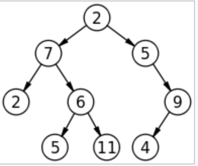

# 二叉树
## 定义
>每个节点最多有两个子节点的树，两个节点称为左子节点，右子节点。
## 图例

## 类型
1. 完全二叉树  
若二叉树的高度为h，除第h层外，其他各节点数都达到嘴个个数
2. 满二叉树  
除了叶节点外每个节点都有左右子叶且叶子节点都处在最底层
3. 平衡二叉树（ AVL树）  
是一颗空树或它的左右两个子树的高度差绝对值不超过1，并且左右两个子树都是一颗平衡二叉树
## 性质
1. 非空二叉树中，第i层的节点总数不会超过2^(i-1)，i>=1;
2. 深度为h的二叉树最多有2^h-1个节点，h>=1,最少有h个节点 

