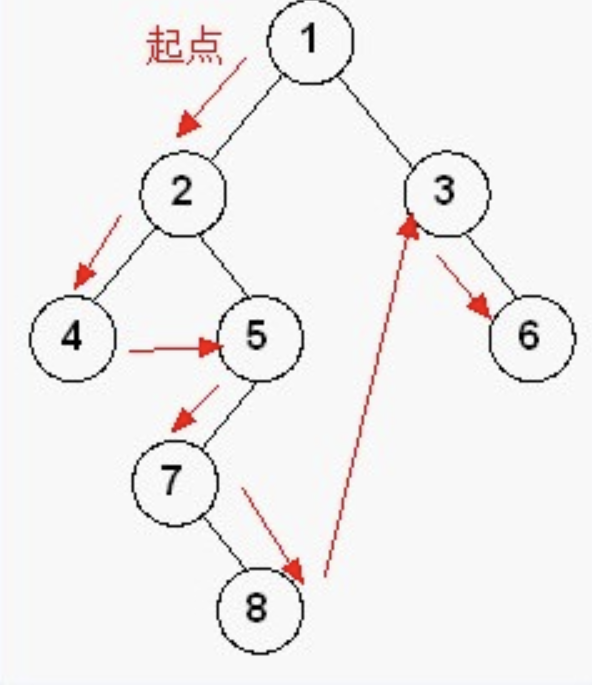
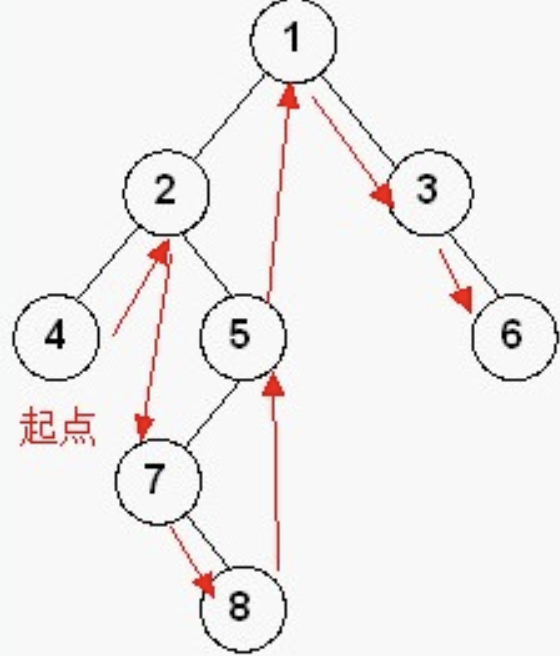
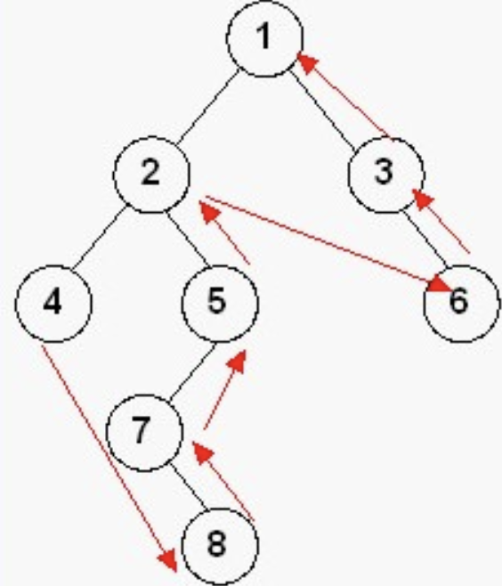

# 二叉树
## 定义
>每个节点最多有两个子节点的树，两个节点称为左子节点，右子节点。
## 图例

## 类型
1. 完全二叉树  
若二叉树的高度为h，除第h层外，其他各节点数都达到嘴个个数
2. 满二叉树  
除了叶节点外每个节点都有左右子叶且叶子节点都处在最底层
3. 平衡二叉树（ AVL树）  
是一颗空树或它的左右两个子树的高度差绝对值不超过1，并且左右两个子树都是一颗平衡二叉树
## 性质
1. 非空二叉树中，第i层的节点总数不会超过2^(i-1)，i>=1;
2. 深度为h的二叉树最多有2^h-1个节点，h>=1,最少有h个节点;
3. 对于任何一颗非空的二叉树，如果叶节点个数为n0，度数为2的节点个数为n2，则有n0=n2+1； 
## 遍历
### 前序遍历
>先访问根结点，再遍历左子树，最后遍历右子树
#### 图例

#### 图例结果
1，2，4，5，7，8，3，6
#### 代码示例
```java
public void PreOrderTraverse(BinaryTree t){
    if(t!=null){
        print(t.data);
        PreOrderTraverse(t.leftChild);
        PreOrderTraverse(t.rightChild)
    }
}
```
### 中序遍历
>先访问左子树，然后访问根结点，最后遍历右子树
#### 图例

#### 图例结果
4，2，7，8，5，1，3，6
#### 代码示例
```java
public void InOrderTraverse(BinaryTree t){
    if(t!=null){
        InOrderTraverse(t.leftChild);
        print(t.data);
        InOrderTraverse(t.rightChild);
    }
}
```
### 后序遍历
>先遍历左子树，再遍历右子树，最后访问根结点
#### 图例

#### 图例结果
4，8，7，5，2，6，3，1
#### 代码示例
```java
public void PostOrderTraverse(BinaryTree t){
    if(t!=null){
        PostOrderTraverse(t.leftChild);
        PostOrderTraverse(t.rightChild);
        print(t.data)
    }
}
```
*三种遍历的区别就在访问数据与遍历左右子树的顺序*


