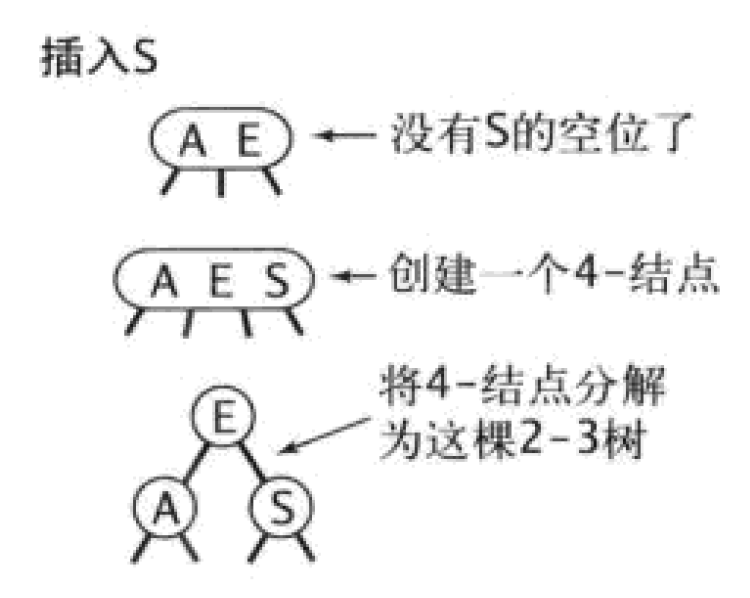
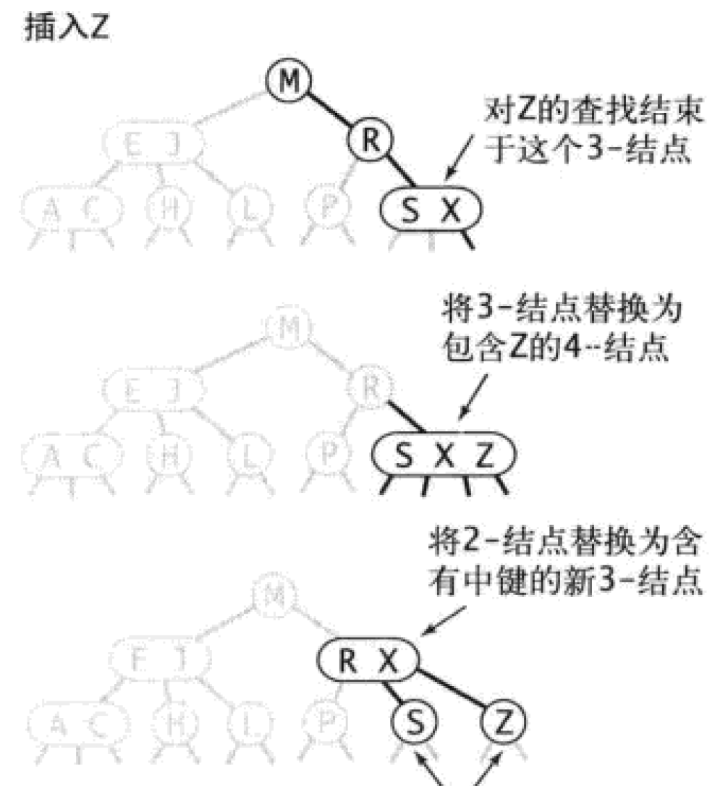
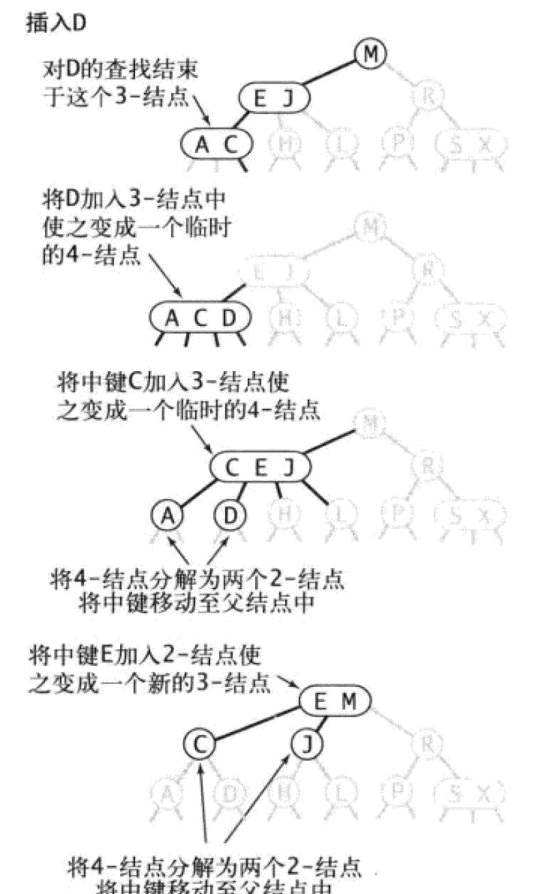
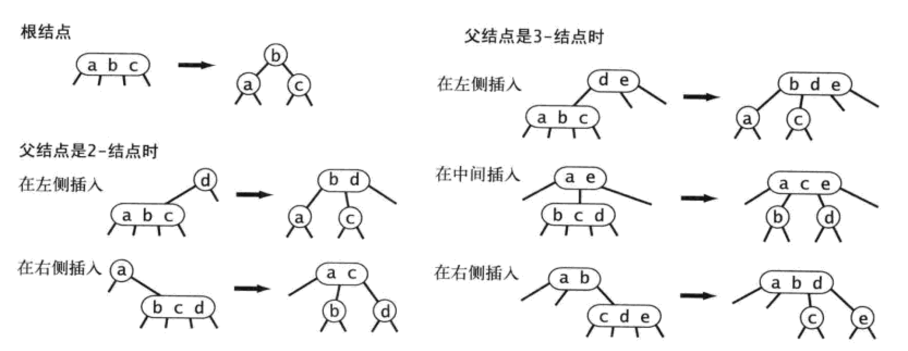

# 红黑树
*参考《算法》第四版3.3
## 2-3查找树
为了保证查找树的平衡性，我们需要一些灵活性，因此在这里我们允许树中的一个结点保存多个键
### 定义
>一颗2-3查找树或为一颗空树，或由以下结点组成：
> * 2-结点，含有一个键和两条链接，左链接指向的2-3树中的键都小于该结点，右链接指向的2-3树中的键都大于该结点。
> * 3-结点，含有两个键和三条链接，左链接指向2-3树中的键都小于该结点，中链接指向的2-3树中的键都位于该结点的两个键之间，右链接指向的2-3树中的键都大于该结点
### 图例

*一颗完美平衡的2-3查找树中的所有空链接到根结点的距离都应该是相同的*
### 查询
略
### 向2-结点中插入新键
如果查找未命中结束于一个2-结点，只要将要插入的键保存在该2-结点即可
### 向一颗只含有一个3-结点的树中插入新键
为了将新建插入，可以临时讲新键插入到该3-节点中，使之称为一个4-结点。该4-结点可以很容易的转换为一颗有3个2-结点组成的2-3树，根结点含有中键，左结点含有最小的键，右结点含有最大的键。插入前书的高度为0，插入后高度为1，表明了2-3树的生长过程。

### 向一个父结点为2-结点的3-结点中插入新键
依旧是将该3-结点转化为4-结点，然后将该4-结点的中键移动到父结点，父结点的中链接指向4-结点的最小值，右链接指向最大值。

### 向一个父结点为3-结点的3-结点中插入新键
递归的将3-结点转化为4-结点，然后分解，直到遇到一个2-结点并替换为不需要分解的3-结点或者达到3-结点的根。

如果从插入的结点到根结点都是3-结点，跟节点就会变成一个临时的4-结点。此时我们可以按照向一颗只有一个3-结点的树中插入新键的方法处理这个问题，使树的高度增加1，但仍然保持了树的完美平衡，因为变换的是根结点

### 局部变换

如上图所示，将一个4-结点分解为一颗2-3树可能有6种情况，这个4-结点可能是根结点，可能是一个2-结点的左子结点或者右子结点，也可能是一个3-结点的左子结点，中子结点或者右子结点。2-3树插入算法的根本在于这些变换都是局部的：除了相关的结点和链接之外不必须、修改或者检查树的其他部分。每次变换中，变更的链接数量不会超过一个很小的常数。需要特别指出的是，不光是在树的底部，树中的任何地方只要符合相应的模式，变换都可以进行。每个变换都会将4-结点中的一个键送入他的父节点中，并重构相应的链接而不必涉及树的其他部分。
### 全局性质
局部变换不会影响树的局部有序性和平衡性：任意空链接到根结点的路径长度都是相等的。
### 总结
在一颗大小为n的2-3树中，查找和插入操作访问的结点必然不超过lgn个。因为需要处理的情况太多，需要维护两种不同类型的结点，将被查找的键和结点中的每个键进行比较，将链接和其他信息从一种结点复制到另一种结点，将结点从一种数据类型转换到另一种数据类型。开销可能会比标准的二叉搜索树更慢，由此我们通过一点代价就能用一种统一的形式完成所有变换，这就是红黑树。

