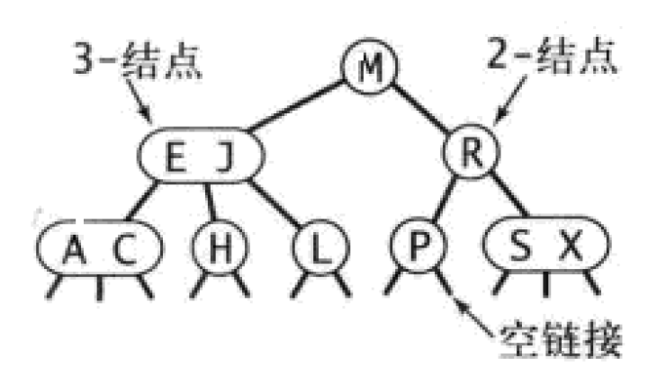

# 红黑树
*参考《算法》第四版3.3
## 2-3查找树
为了保证查找树的平衡性，我们需要一些灵活性，因此在这里我们允许树中的一个结点保存多个键
### 定义
>一颗2-3查找树或为一颗空树，或由以下结点组成：
> * 2-结点，含有一个键和两条链接，左链接指向的2-3树中的键都小于该结点，右链接指向的2-3树中的键都大于该结点。
> * 3-结点，含有两个键和三条链接，左链接指向2-3树中的键都小于该结点，中链接指向的2-3树中的键都位于该结点的两个键之间，右链接指向的2-3树中的键都大于该结点
### 图例

*一颗完美平衡的2-3查找树中的所有空链接到根结点的距离都应该是相同的*