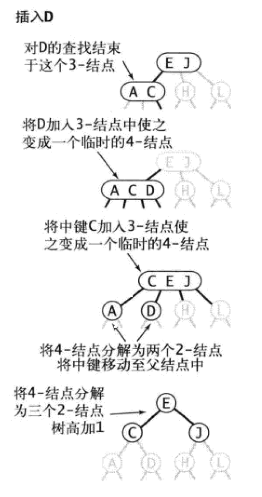

# 红黑树
*参考《算法》第四版3.3
## 2-3查找树
为了保证查找树的平衡性，我们需要一些灵活性，因此在这里我们允许树中的一个结点保存多个键
### 定义
>一颗2-3查找树或为一颗空树，或由以下结点组成：
> * 2-结点，含有一个键和两条链接，左链接指向的2-3树中的键都小于该结点，右链接指向的2-3树中的键都大于该结点。
> * 3-结点，含有两个键和三条链接，左链接指向2-3树中的键都小于该结点，中链接指向的2-3树中的键都位于该结点的两个键之间，右链接指向的2-3树中的键都大于该结点
### 图例

*一颗完美平衡的2-3查找树中的所有空链接到根结点的距离都应该是相同的*
### 查询
略
### 向2-结点中插入新键
如果查找未命中结束于一个2-结点，只要将要插入的键保存在该2-结点即可
### 向一颗只含有一个3-结点的树中插入新键
为了将新建插入，可以临时讲新键插入到该3-节点中，使之称为一个4-结点。该4-结点可以很容易的转换为一颗有3个2-结点组成的2-3树，根结点含有中键，左结点含有最小的键，右结点含有最大的键。插入前书的高度为0，插入后高度为1，表明了2-3树的生长过程。

### 向一个父结点为2-结点的3-结点中插入新键
依旧是将该3-结点转化为4-结点，然后将该4-结点的中键移动到父结点，父结点的中链接指向4-结点的最小值，右链接指向最大值。

### 向一个父结点为3-结点的3-结点中插入新键
递归的将3-结点转化为4-结点，然后分解，直到遇到一个2-结点并替换为不需要分解的3-结点或者达到3-结点的根。

如果从插入的结点到根结点都是3-结点，跟节点就会变成一个临时的4-结点。此时我们可以按照向一颗只有一个3-结点的树中插入新键的方法处理这个问题，使树的高度增加1，但仍然保持了树的完美平衡，因为变换的是根结点

### 局部变换

如上图所示，将一个4-结点分解为一颗2-3树可能有6种情况，这个4-结点可能是根结点，可能是一个2-结点的左子结点或者右子结点，也可能是一个3-结点的左子结点，中子结点或者右子结点。2-3树插入算法的根本在于这些变换都是局部的：除了相关的结点和链接之外不必须、修改或者检查树的其他部分。每次变换中，变更的链接数量不会超过一个很小的常数。需要特别指出的是，不光是在树的底部，树中的任何地方只要符合相应的模式，变换都可以进行。每个变换都会将4-结点中的一个键送入他的父节点中，并重构相应的链接而不必涉及树的其他部分。
### 全局性质
局部变换不会影响树的局部有序性和平衡性：任意空链接到根结点的路径长度都是相等的。
### 总结
在一颗大小为n的2-3树中，查找和插入操作访问的结点必然不超过lgn个。因为需要处理的情况太多，需要维护两种不同类型的结点，将被查找的键和结点中的每个键进行比较，将链接和其他信息从一种结点复制到另一种结点，将结点从一种数据类型转换到另一种数据类型。开销可能会比标准的二叉搜索树更慢，由此我们通过一点代价就能用一种统一的形式完成所有变换，这就是红黑树。
## 红黑树
### 定义
>红黑树的一种定义是含有红黑链接并满足下列条件的二叉查找树
>* 红链接均为左链接
>* 没有任何一个结点同时和两条红链接相连
>* 该树是完美黑色平衡的，即任意空链接到根结点的路径上的黑链接数量相同
### 与2-3树关系
红黑树背后的基本思想是用标准的二叉查找树和一些额外的信息来表示2-3树。将树中的链接分为两种类型：红链接将两个2-结点链接起来构成一个3-节点，黑链接则是2-3树中的普通链接。确切的说，将3-结点表示为由一条左斜的红色链接相连的2-节点。如下图所示。如果将一颗红黑树中的红链接画平，那么所有的空链接到根结点的距离都是相同的。如果将红链接相连的结点合并，得到的就是2-3树。相反，如果将一颗2-3树中的3-结点画作由红色左链接相连的两个2-节点，那么不会存在能够和两条红链接相连的节点。

### 结点的颜色表示
将一个结点的颜色定义为指向它的链接的颜色（从父结点指向它），如果指向它的链接是红色，那么该变量为true，黑色则为false。约定空链接为黑色。
```java
private static final boolean RED=true;
private static final boolean BLACK=false;

private class Node{
    Key key;//键
    Value val;//相关联的值
    Node left,right;//左右子树
    int N;//这颗子树中结点总数
    boolean color;//父结点指向它的链接的颜色
    Node(Key key,Value val,int N,boolean color){
        this.key=key;
        this.val=val;
        this.N=N;
        this.color=color
    }
}
// 测试结点x和它父结点之间的链接的颜色
private boolean isRed(Node x){
    if(x==null){
        return false;
    }
    return x.color==RED;
}
```
### 旋转
实现的某些操作中可能会出现红色右链接或者两条连续的红链接，但在操作完成前这些情况都会被小心的旋转并修复。旋转操作会改变红链接的指向。假设有一条红色的右链接需要被转化为左链接，这个操作称为左旋转。大体思路是将两个键中的较小者作为根节点变为较大者作为根结点。实现降一个红色左链接转换为一个红色右链接的一个右旋转的代码完全相同，只需要调换left和right即可。
```java
Node rotateLeft(Node h){
    Node x = h.left;
    h.right = x.left;
    x.left = h;
    x.color = h.color;
    h.color = RED;
    x.N = h.N;
    h.N=1+size(h.left)+size(h.right);
    return x;
}
Node rotateRight(Node h){
    Node x = h.left;
    h.left = x.right;
    x.right = h;
    x.color=h.color;
    h.color=RED;
    x.N=h.N;
    h.N=1+size(h.right)+size(h.left);
    return x;
}
```
*左旋转*

*左旋转结果*

*右旋转*

*右旋转结果*


### 旋转后重置父节点的链接
无论左旋转还是右旋转，旋转操作都会返回一条链接，总会用旋转的两个方法的返回值重置父结点中相应的链接。
### 向2-结点中插入新键