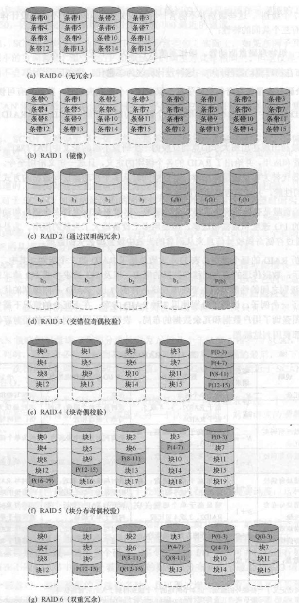

# IO
## 分类
1. 人可读 适用于计算机用户间的交互
2. 机器可读 适用于与电子设备通信
3. 通信 适用于与远程设备通信
## 执行io的三种技术
1. 程序控制IO
2. 中断驱动IO
3. 直接存储器访问（DMA)
## IO功能的逻辑结构
用户进程->逻辑io->设备io->调度和控制->硬件
## I/O缓冲
* 面向块的设备 将信息保存在块中，块大小是固定的，传送过程中一次传送一块
* 面向流的设备 以字节流方式输入输出
1. 单缓冲  输入传送的数据被放到系统缓冲区，传送完成时，进程把块移动到用户空间，并立即请求另一块。面向流每次传送一行
2. 双缓冲  进程想一个缓冲区传送数据（或读取）的同时，操作系统清空（或填充）另一个缓冲区
3. 循环缓冲
## 磁盘调度
### 磁盘性能参数
* 寻道时间 将磁头臂移动到指定磁道需要的时间
* 旋转延迟 将磁盘的待访问地址区域宣传到刺头可访问位置所需要的时间
* 传输时间 向磁盘传送，或从磁盘传送传送的时间,取决于磁盘旋转速度
### 磁盘调度策略
1. 先进先出(FIFO) 按照顺序处理队列中的项目
2. 优先级（pri)
3. 后进先出（LIFO)
4. 最短服务时间优先(SSTF) 选择使磁头臂从当前位置开始移动最少的IO请求
5. SCAN 要求磁头臂仅沿一个方向移动，并在途中满足所有未完成的请求，知道到达这个方向的最后一个磁道，接着反转服务方向
6. C-SCAN 把扫描限定到一个方向上
7. n-scan 把请求分成长度为n的几个队列
8. FSCAN 使用两个队列，新请求放入第二个队列
### RAID

### 磁盘高速缓存
内存中为磁盘扇区设置的一个缓冲区。页面置换算法同虚拟内存

# 文件管理
## 文件组织
1. 堆 数据按照到达的顺序被收集
2. 顺序文件 每条记录实用固定格式
3. 索引顺序文件
4. 索引文件
5. 直接或散列文件

