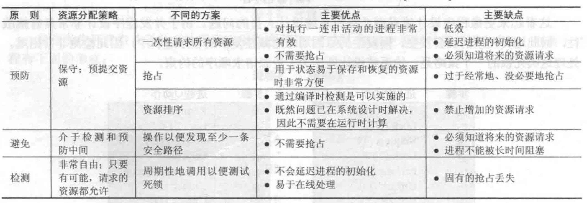

# 并发
## 多进程访问的资源
1. 处理器时间
2. 存储器
3. 文件
4. I.O设备
## 互斥的硬件支持
1. 中断禁用 只能在但处理器中使用
2. 专用机器指令 比较和交换，exchage  
    机器指令方法的特点  
    * 适用但处理器或共享内存的多处理器上的任意数量进程
    * 简单且易于证明
    * 支持多个临界区，每个临界区可以用自己的变量定义  

    缺点
    * 使用了忙等待
    * 可能饥饿
    * 可能死锁
## 提供并发的操作系统和程序设计语言的机制
### 信号量
>基本原理：两个或多个进程可以通过简单的信号进行合作，可以强迫一个进程在某个位置停止，知道它接收到一个特定的信号  
三个操作：
1. 一个信号量可以初始化为非负数
2. semWait操作使信号减1，若值变成负数，则阻塞执行semWait的进程
3. semSignal操作使信号量加1，若值小于等于0，则被semWait操作阻塞的进程解除阻塞

## 死锁
>死锁定义为一组相互竞争系统资源或进行通信的进程间的永久阻塞。
### 死锁的条件
条件
1. 互斥
2. 占有且等待
3. 不可抢占
4. 循环等待  

方法

