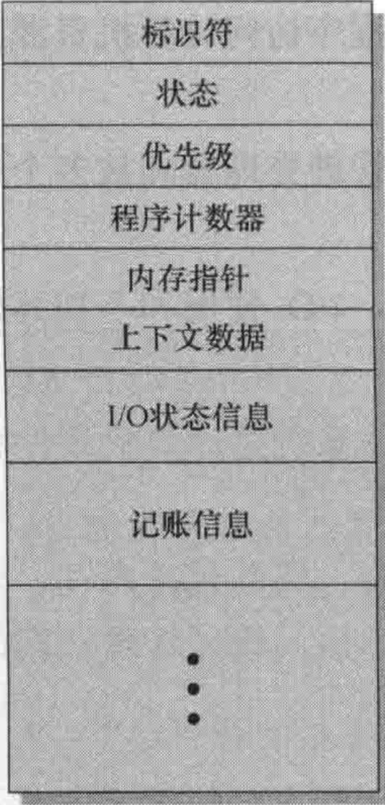
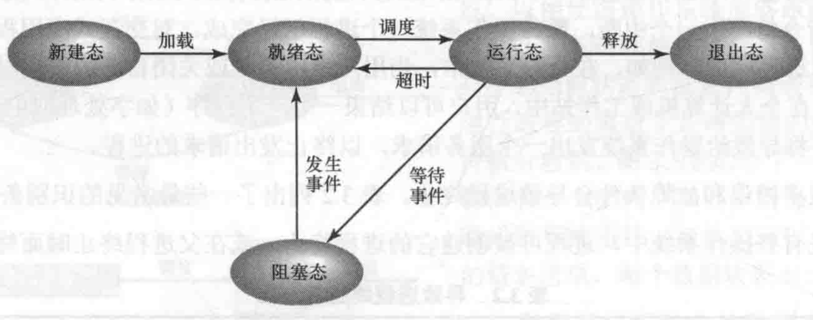
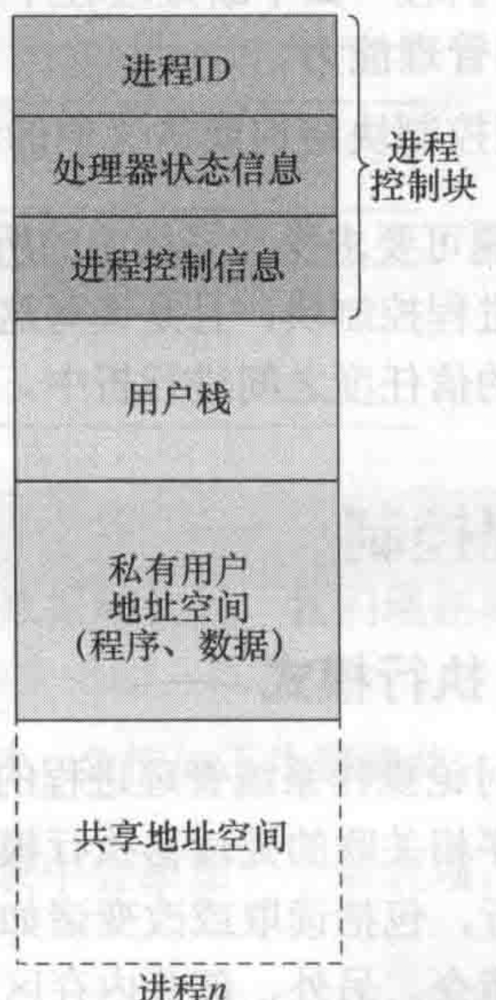
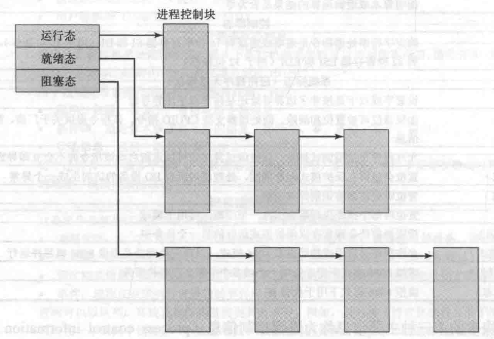

# 进程线程管理
## 进程
### 定义
>计算机程序关于关于某数据集合的一次运行活动。
### 进程控制块
由操作系统创建和管理。是操作系统为支持多进程并提供多重处理技术的关键工具

*进程控制快信息*
### 进程状态
1. 创建  
将一个新的进程添加到正被管理的进程集时，操作系统需要建立用于管理该进程的数据结构，并在内存中给它分配地址。创建原因：新的批处理作业；交互登录；为提供服务而由操作系统创建；由现有进程派生
2. 终止/退出  
3. 运行  
单处理器最多只有一个进程运行
4. 就绪  
5. 阻塞/等待  
等待事件，比如io

*五状态进程模型*
6. 挂起  
不在内存中的进程
### 进程控制结构
程序，数据，栈和属性的集合（进程控制块）成为进程映像

*虚存中的用户进程*
进程控制块包含操作系统所需要进程的所有信息。

*队列可实现为进程控制块的链表*
### 进程控制
 运行模式：特权模式，用户模式  
 内核模式典型功能：进程管理，内存管理，io管理，中断处理，记账，监视  
 进程中断机制：中断，陷阱，系统调用

## 线程
### 定义
线程被称为轻量级进程，是程序执行流的最小单元
### 与进程的区分
拥有资源所有权的单位称为进程，分派的单位称为线程，进程中所有线程共享该进程的状态和资源。
### 线程状态
主要状态有运行态，就绪态，阻塞态。挂起态对线程没有意义。
### 分类
1. 用户级线程 纯用户级软件中，管理线程的所有工作由应用程序完成，内核意识不到线程的存在。缺点：会阻塞进程中的其他线程；不能利用多处理技术。
2. 内核级线程 纯内核级软件中，管理线程的所有工作均由内核完成，应用级没有管理线程的代码，只有一个到内核线程设施的应用编程接口。缺点：把控制权从一个线程传送到同一个进程的另一个线程时，需要切换到内核模式。