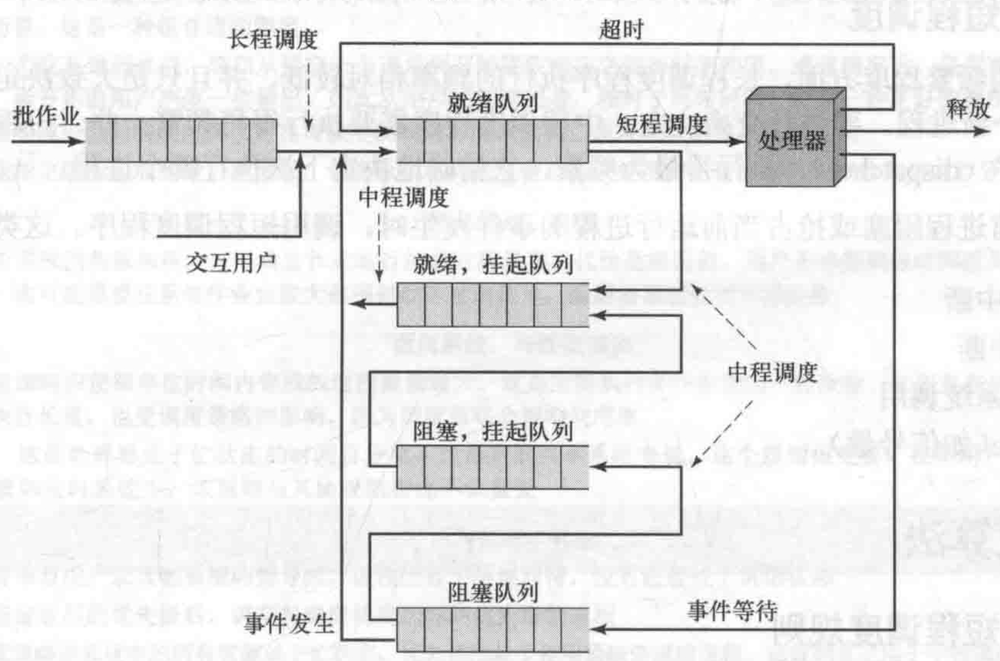
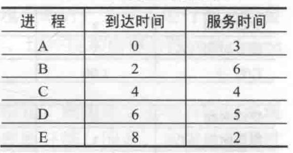
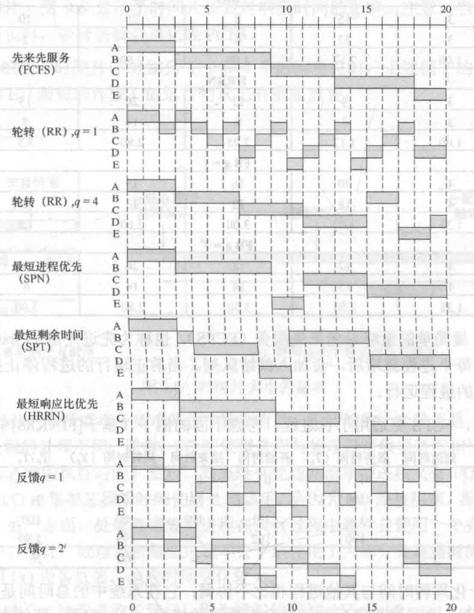
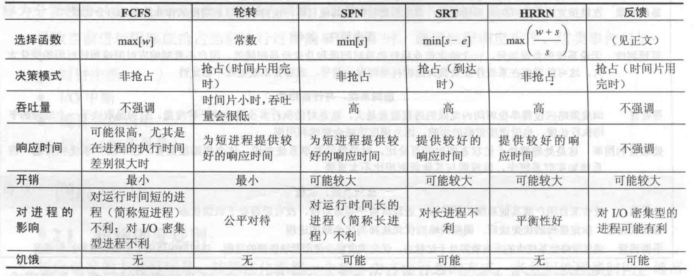

# 处理器调度
## 类型
1. 长程调度  决定加入待执行进程池
2. 中程调度  决定加入部分或全部位于内存中的进程集合
3. 短程调度  决定处理器执行哪个可运行进程
4. I/O调度  决定可用io设备处理器哪个进程挂起io请求
## 调度的队列图

*由图可见，长程调度发生在创建进程中；中程调度发生在进程挂起；短程调度发生在就绪队列与运行之间。*
## 短程调度  
导致当前进程阻塞或抢占当前运行进程的事件发生时，调用短程调度程序，事件包括：时钟中断，IO中断，操作系统调用，信号。以下调度算法主要指短程调度。
## 调度规则
### 面向用户
* 与性能相关  
    1. 周转时间 进程从提交到完成之间的时间间隔
    2. 相应时间 进程从提交到开始接收响应之间的时间间隔
    3. 最后期限 降低其他目标，是的满足最后期限的作业数量的百分比最大
* 其他  
    1. 可预测性 
### 面向系统
* 与性能相关  
    1. 吞吐量 单位时间完成的进程数量最大
    2. 处理器利用率 处理器处于忙状态的时间比。
* 其他  
    1. 公平性 进程应被平等的对待，没有进程处于饥饿状态
    2. 强制优先级 调度策略选择高优先级的进程
    3. 平衡资源 调度策略使系统中的所有资源处于忙状态，优先调度较少实用紧缺资源的进程
## 调度方法
### 选择函数
选择函数可以根据优先级，资源需求或进程的执行特性来进行选择，对于最后一种情况，三个参数非常重要：w，目前为止在系统中停留时间。e，目前为止话费的执行时间。s，进程所需总服务时间，包括e，通常需进行估计或用户提供。
### 决策模式
1. 非抢占 处于运行，不断执行。io阻塞或请求操作系统服务
2. 抢占 当前正运行的进程可能被操作系统中断，并转换为就绪态
### 各种策略图例
  
*进程调度实例*
  
*调度策略*  
### 部分策略解释
 最高响应比  max((w+s)/s)  
 反馈 时间便完成后，优先级降低
### 各种策略特点

## 实时调度
### 定义
>系统的正确性不仅取决于计算的逻辑结果，而且取决于产生结果的时间。
### 分类
1. 硬实时任务 必须满足最后期限的任务
2. 软实时任务 最后的期限不强制
### 特点
* 可确定性 可以按照固定的，预先确定的时间或者时间间隔执行操作
* 可响应性 关注中断后，操作系统为中断提供服务的时间
* 用户控制 用户应能够区分硬实时任务和软实时任务，并去定优先级
* 可靠性
* 故障弱化操作 系统在故障时尽可能多的保存其性能和数据的能力

