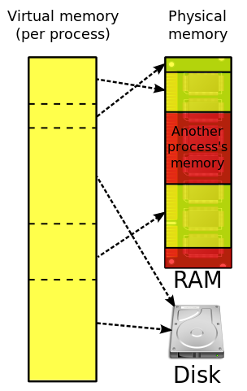

# 虚拟内存管理
## 定义
>虚拟内存是计算机系统内存管理的一种技术。它使得应用程序认为它拥有连续的可用的内存（一个连续完整的地址空间）。而实际上，它通常是被分割成多个物理内存碎片，还有部分暂时存储在外部磁盘存储器上，在需要时进行数据交换。
## 图例

*虚拟内存讲ram和硬盘结合起来形成比较大的地址空间*

## 可行性
局部性原理：描述了一个进程中程序和数据引用的集簇倾向。包括时间局部性和空间局部性