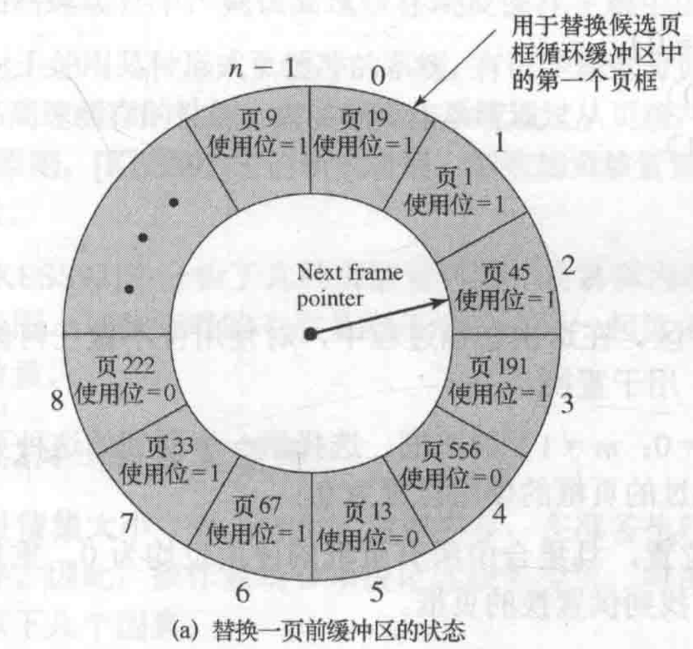
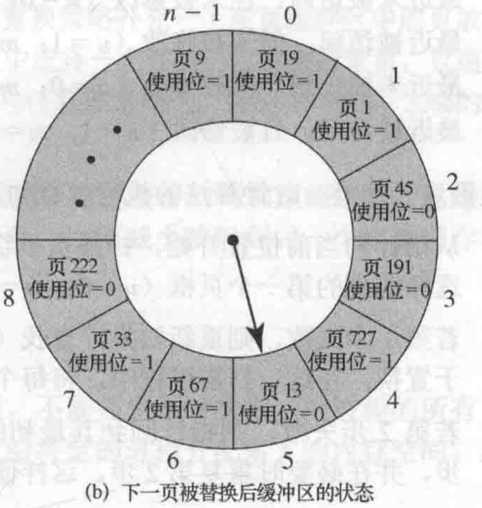

# 虚拟内存管理
## 定义
>虚拟内存是计算机系统内存管理的一种技术。它使得应用程序认为它拥有连续的可用的内存（一个连续完整的地址空间）。而实际上，它通常是被分割成多个物理内存碎片，还有部分暂时存储在外部磁盘存储器上，在需要时进行数据交换。
## 图例

*虚拟内存讲ram和硬盘结合起来形成比较大的地址空间*

## 可行性
局部性原理：描述了一个进程中程序和数据引用的集簇倾向。包括时间局部性和空间局部性
## 读取策略
1. 请求分页
2. 预先分页
## 放置策略
* 纯分页或段页式系统中无关紧要
* 对于非一致存储访问多处理器，性能会有关
## 置换策略（包含驻留集）
用于处理在必须读取一个新页时，应该置换内存中的哪一页
### 约束条件
内存中的某些页框可能被锁定。包括：大部分操作系统内核，重要的控制结构，I/O缓冲区，对时间要求严格的区域。通过在页框关联锁定位实现
### 算法
1. 最佳（Optimal,OPT)  
选择置换下次访问距离当前时间最长的页，导致缺页中断最少。
2. 最近最少使用（Least Recently Used,LRU)  
置换内存中最长时间未被引用的页。难以实现，实现方法：添加最后访问时间戳或者维护关于访问的栈。
3. 先进先出（First In First Out,FIFO)  
FIFO策略吧分配给进程的页框视为一个循环缓冲区，并按循环方式移动页。隐含的逻辑是置换驻留在内存中时间最长的页。容易产生belay现象，增加内存，反而产生更多缺页。
4. 时钟（Clock)
    * 页面装入内存时，访问位初始化为0（操作系统精髓与设计原理中设置为1）
    * 访问页面（读/写），访问位置1
    * 缺页时，从指针当前位置顺顺序检查环形链表
        * 访问位为0，则置换该页
        * 访问位为1，则设置为0，并指针移动到下一个页面，直到找到可置换的页面  
          
        图例（需要换进727页）  
        1. 如图a，指针开始指向页框2，页45使用位为1，不能被置换，使用位被置为0
        2. 指针继续前进，页框3同上设置
        3. 页框4使用位是0，556页被727置换，使用位设为0
        4. 指针前进到页框5，完成置换
        
        *换页前状态*
        
        *替换后状态*
    
5. 改进时钟算法  
减少修改页开销，增加修改位
6. 工作集置换  
换出不在工作集中的页面
* 工作集：表示为二元函数W(t,△),t为当前时刻，△为页面访问时间窗口，工作集就是在t-△到t的这段时间内所有访问页面的集合
* 常住集：当前时刻，进程实际驻留在内存当中的页面集合
* 实现方法：
   * 访存链表：维护窗口内的仿存页面链表
   * 访存时，患处不再工作集的页面；更新仿存链表
   * 缺页时，换入页面；更新访存链表